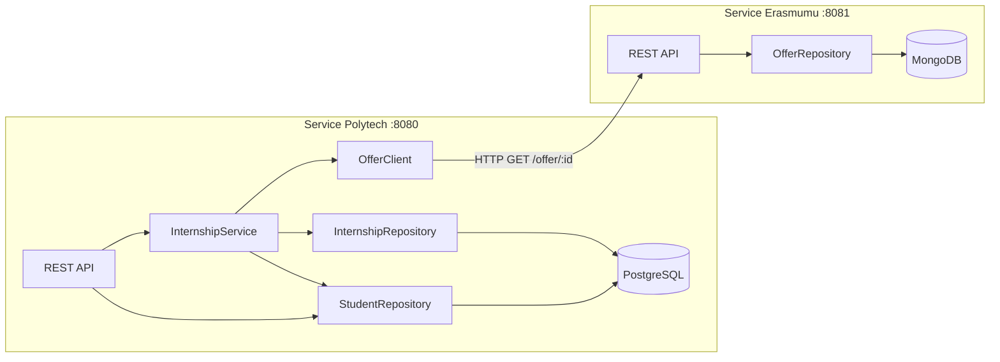

# Polymove — Walkthrough

## Architecture



## Commits (branch `lab-synchrone-com-polytech-erasmumu`)

| # | Commit | Scope |
|---|--------|-------|
| 1 | `feat(core): add domain entities` | Student, Offer, Internship structs + DTOs |
| 2 | `feat(core): add domain ports` | Repository traits, OfferClient trait, DomainError |
| 3 | `feat(polytech): add student PostgreSQL adapter` | sqlx runtime queries, SQL migration |
| 4 | `feat(polytech): add student REST API routes` | CRUD endpoints + error mapping |
| 5 | `feat(erasmumu): add offer service` | MongoDB adapter (availability filter) + CRUD routes |
| 6 | `feat(polytech): add internship registration` | InternshipService use case, HTTP client, routes |
| 7 | `chore: add Docker Compose` | PostgreSQL 16 + MongoDB 7 |

## How to Run

```bash
# 1. Start databases
docker compose up -d

# 2. Start Erasmumu (port 8081)
cargo run --bin erasmumu

# 3. Start Polytech (port 8080) in another terminal
cargo run --bin polytech
```

## API Quick Reference

### Polytech (`:8080`)
- `POST /student` — create student
- `GET /student/{id}` — get by ID
- `GET /student?domain=IT` — filter by domain
- `PUT /student/{id}` — update
- `DELETE /student/{id}` — delete
- `POST /internship` — register for an offer (domain matching)
- `GET /internship/{id}` — check status

### Erasmumu (`:8081`)
- `POST /offer` — create offer
- `GET /offer/{id}` — get (only if available)
- `GET /offer?domain=IT` — filter by domain
- `GET /offer?city=Paris` — filter by city
- `PUT /offer/{id}` — update
- `DELETE /offer/{id}` — delete
