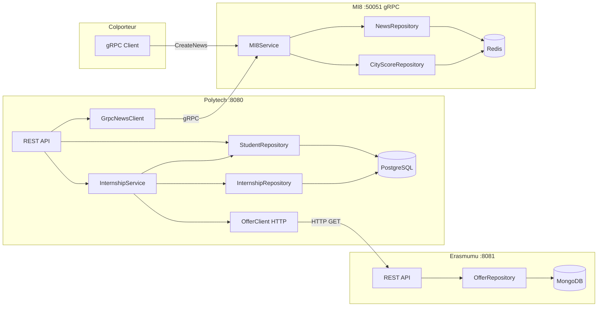

# Polymove

## Architecture



## Services

| Service | Port | Stack | Base de données |
|---------|------|-------|-----------------|
| **Polytech** | 8080 | Actix-web REST | PostgreSQL |
| **Erasmumu** | 8081 | Actix-web REST | MongoDB |
| **MI8** | 50051 | Tonic gRPC | Redis |
| **Colporteur** | — | Script gRPC | — |

## How to Run

```bash
# 1. Start databases
docker compose up -d

# 2. Start MI8 (port 50051)
export PATH="$HOME/.local/bin:$PATH"
cargo run --bin mi8

# 3. Inject news via Colporteur
cargo run --bin colporteur

# 4. Start Erasmumu (port 8081)
cargo run --bin erasmumu

# 5. Start Polytech (port 8080)
cargo run --bin polytech
```

## API

### Polytech `:8080`
- `POST /student` — créer un étudiant
- `GET /student/{id}` — par ID
- `GET /student?domain=IT` — filtrer par domaine
- `PUT /student/{id}` — modifier
- `DELETE /student/{id}` — supprimer
- `POST /internship` — inscription stage (domain matching)
- `GET /internship/{id}` — statut inscription
- `GET /news?limit=5` — dernières actualités (via MI8 gRPC)
- `GET /news?city=Paris&limit=3` — actualités par ville

### Erasmumu `:8081`
- `POST /offer` — créer une offre
- `GET /offer/{id}` — par ID (filtre available)
- `GET /offer?domain=IT` — filtrer par domaine
- `GET /offer?city=Paris` — filtrer par ville
- `PUT /offer/{id}` — modifier
- `DELETE /offer/{id}` — supprimer

### MI8 `:50051` (gRPC)
- `GetLatestNews(limit)` — N dernières news
- `GetLatestNewsInCity(city, limit)` — news par ville
- `CreateNews(news)` — créer + mise à jour score ville
- `GetCityScore(city)` — score d'une ville
- `GetTopCities(limit)` — classement villes (ascendant)

## City Scoring

Chaque ville démarre à **1000 pts** par métrique. Les tags des news modifient les scores :

| Tag | QoL | Safety | Economy | Culture |
|-----|:---:|:------:|:-------:|:-------:|
| innovation | +30 | +20 | +60 | +5 |
| crime | -40 | -80 | -20 | -10 |
| festival | +20 | 0 | +10 | +60 |
| economy | +10 | 0 | +50 | 0 |
| pollution | -50 | -10 | -5 | -5 |
| tourism | +20 | +5 | +30 | +40 |
| education | +30 | +10 | +20 | +30 |
| health | +40 | +20 | +10 | 0 |
| sports | +20 | +5 | +15 | +30 |
| politics | 0 | -10 | +10 | 0 |

> Un score ne descend jamais en dessous de **0**.

## Tests

```bash
cargo test --workspace
# 27 tests: 10 erasmumu + 13 polytech + 4 city_score
```
